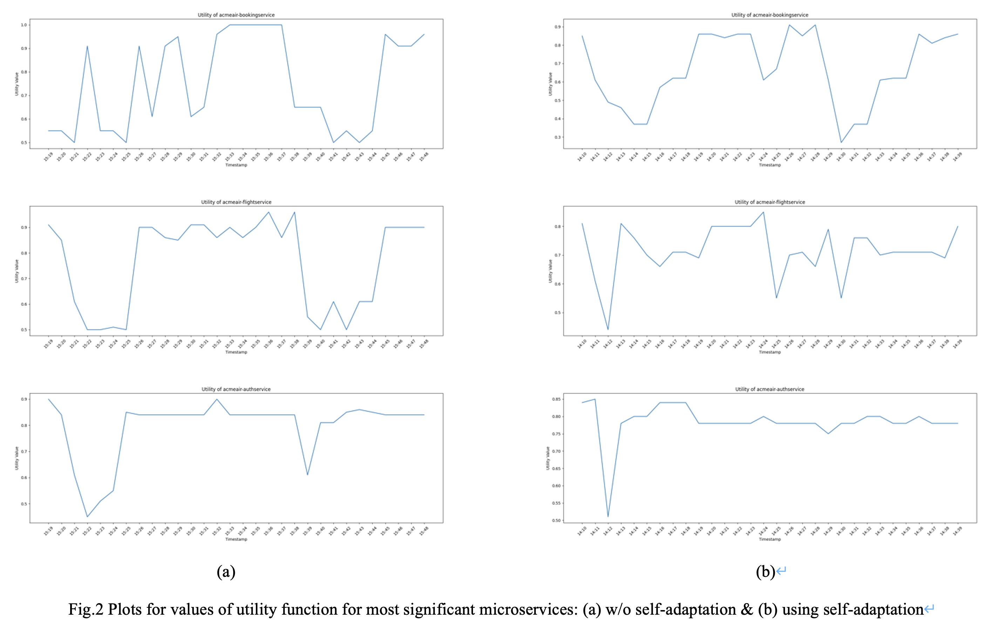

# A Self-adaptive Auto-scaling System
> The Final Project of ECE 750 Self-Adaptive System, by Lucian Zhao and Guanjie Wang
## Overview

This project presents an intelligent auto-scaling system designed for microservices performance optimization on IBM Cloud. Utilizing the Monitoring-Analysis-Planning-Execution-Knowledge (MAPE-K) self-adaptation loop model, the system dynamically adjusts to fluctuating workloads, ensuring efficient resource utilization and system responsiveness.

## Features

- **MAPE-K Loop**: The system utilizes the MAPE-K model for continuous adaptation. It incorporates a model-switching algorithm within the analysis phase, allowing the system to select the most appropriate predictive model based on current conditions, such as workload intensity and performance requirements.

- Three-Layer Architecture

  : The system's architecture consists of:

  1. **Goal Management Layer**: Manages user and system requirements.
  2. **Change Management Layer**: Includes the MAPE-K loop and handles the dynamic model switching.
  3. **Components Management Layer**: Contains the functional components of the system.

- **LSTM-Based Workload Forecasting**: Employs a Long Short-Term Memory (LSTM) network for accurate prediction of dynamic workloads.

- **OpenShift CLI for Execution**: Uses OpenShift Command Line Interface for dynamic scaling of pods and resource adjustment.

## System Architecture

The system architecture is divided into three main components:

## Implementation

- **Model Switching Algorithm**: The system can switch between various predictive models, including statistical and machine learning (LSTM) methods, to optimize its forecasting accuracy and efficiency.
- **Workload Simulation**: JMeter is used for simulating dynamic workloads, testing the system’s adaptability under various conditions.
- **Resource Management**: Employs Docker containers for encapsulating services, orchestrated by OpenShift for real-time adaptations.
- **Performance Monitoring**: Uses IBM Cloud monitoring tools, including Sysdig, for tracking performance metrics.

## Testing and Validation

- **Performance Testing**: Conducted using a Python script integrated with JMeter.
- **Adaptation Efficiency**: Validated through real-time adaptation to workload changes, ensuring optimal performance and resource utilization.

